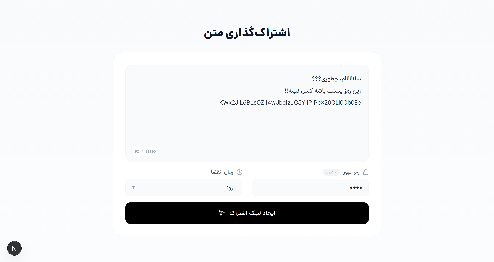
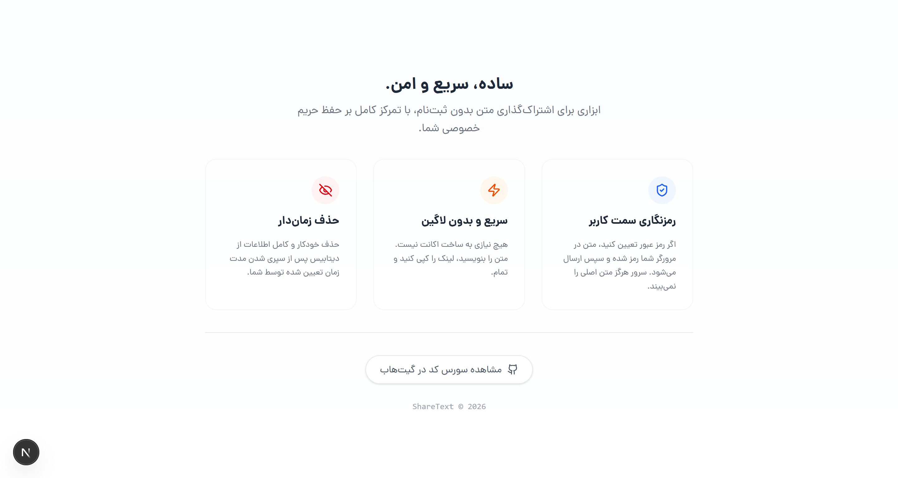
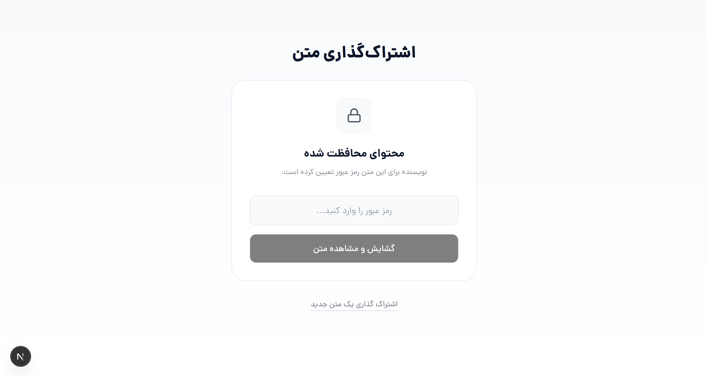
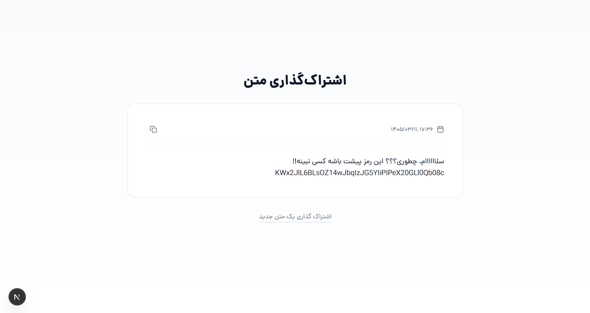

# ShareText

Minimal encrypted text sharing platform for creating temporary private links without authentication.

## Features

- Create temporary text shares via unique links
- Optional password-protected encrypted content
- Client-side encryption and decryption
- Automatic expiration and cleanup
- Authentication-free minimal flow
- Server Actions-based architecture (no manual API calls)
- Lightweight and fast UX

## Screenshots

## Overview

ShareText allows users to securely share text without accounts or setup. Everything is designed around instant creation and minimal friction.

Content is encrypted in the browser before being sent to the server, ensuring that the backend never stores readable data.

## Architecture

### Client-Side Encryption

All sensitive content is encrypted in the browser before upload. The server only stores encrypted payloads.

### Server Actions (Next.js)

Uses Next.js Server Actions instead of traditional API routes, removing the need for manual fetch layers and simplifying data flow.

### Temporary Storage System

Shared content can expire automatically after a set time, enabling lightweight and disposable sharing.

## Tech Stack

- Next.js
- React
- TypeScript
- Drizzle ORM
- PostgreSQL
- Tailwind CSS
- Docker
- Biome
- React Compiler
